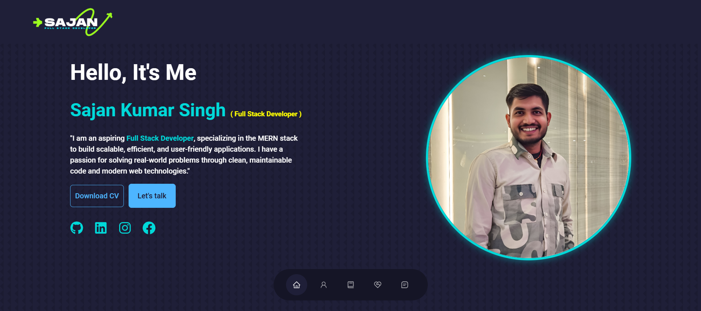

# React JS Portfolio Website

[Live Demo](https://sajansingh-portfolio.vercel.app/)

## Features

- **Single-Page Layout**
- **Styled with React-Bootstrap and Customizable CSS**
- **Fully Responsive Design**
**📖 Single-Page Layout**

## Getting Started
**🎨 Styled with React-Bootstrap and CSS with easy to customize colors**

To set up the project locally, ensure that you have `Node.js` and `Git` installed globally on your machine.
**📱 Fully Responsive**

## Installation and Setup Instructions
 

1. **Install Dependencies**: Run `npm install` to install all necessary packages.
## 🚀 How to get started?

2. **Start the Development Server**: Execute `npm start` in the project directory.
Clone down this repository. You will need `node.js` and `git` installed globally on your machine.

   This command will start the application in development mode.\
   You can view it in your browser at [http://localhost:3000](http://localhost:3000). The page will automatically reload if you make changes to the code.
## 🛠 Installation and Setup Instructions

## Contribution
1. Installation: `npm install`

Contributions are welcomed! If you have any suggestions or improvements, feel free to open a pull request.
2. In the project directory, you can run: `npm start`

### Support
Runs the app in the development mode.\
Open [http://localhost:3000](http://localhost:3000) to view it in the browser. 
The page will reload if you make edits.

Show your support by starring this repository! ⭐
 
Feel free to contribute to this repo.

<h1 align="center"> Happy Coding! </h1>

